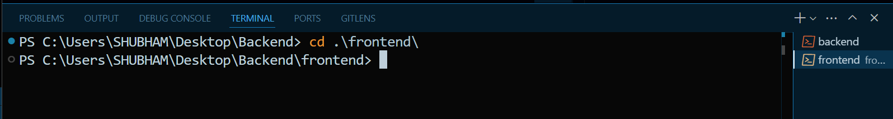

## Backend course by Hitesh choudhary.

### 1. Build an App and Deploy.

1. Start a empty node app

```bash
npm init
```

2. Install express

```bash
npm install express
```

3. Explanation of basic express code block.

```javascript
const express = require("express"); // create a express variable
const app = express(); // create a express app. this app holds all powers of express.
const port = 3000; // this our port

// here, express listen get method on `/` route
app.get("/", (req, res) => {
  res.send("Hello World!");
});

// here the main thing that express does. i.e start listening port:3000
app.listen(port, () => {
  console.log(`Example app listening on port ${port}`);
});
```

**To run server simultanously while writing code. change the script.**

```javascript
"scripts": {
    "start": "npx nodemon index.js"
  },
```

Now, here with these code, we are deploying the app.

1. Make sure .env file is in .gitignore

<hr>

### 2. How to connect Frontend and Backend in **different** **ways**.

1. Create two folders in root dir. **frontend**.
2. Create node app by running the command.
3. Install express.
4. Create index.js
5. change script.

**Note** - When i use module js way to import, there comes error. but by adding following **type**. error can be handle beautifully.

```json
 "main": "index.js",
  "type": "module",  // <<<<------->>>>
```

Now, in index.js, the content is.

```javascript
import express from "express";

const app = express();

app.get("/", (req, res) => {
  res.send("<h2>Hello world from Chai..</h2>");
});

app.get("/jokes", (req, res) => {
  const jokes = [
    {
      id: 1,
      title: "Why don't scientists trust atoms?",
      content: "Because they make up everything!",
    },
    {
      id: 2,
      title: "Why did the math book look sad?",
      content: "Because it had too many problems.",
    },
    {
      id: 3,
      title: "What do you call fake spaghetti?",
      content: "An impasta!",
    },
    {
      id: 4,
      title: "Why did the scarecrow win an award?",
      content: "Because he was outstanding in his field.",
    },
    {
      id: 5,
      title: "How does a penguin build its house?",
      content: "Igloos it together.",
    },
  ];

  res.send(jokes);
});

const port = process.env.PORT || 3000;

app.listen(port, () => {
  console.log(`Express app is running on server ${port}`);
});
```

Now, about frontend part. we used to deploy frontend apps on vercel. but it was frontend apps not full stack. **When it comes to deploy full stack app, distribution and all stuff comes in.**

There are two terminal on. first on which backend server is ON, on other frontend stuff will going to do. **We can change color and name of terminal.**



1. We have to create `Vite React App`.
2. Also we want to create React App in frontend folder So, **Run following command on frontend terminal where current directory is frontend folder itself.**

_PS C:\Users\SHUBHAM\Desktop\Backend\frontend> `npm create vite@latest .`_. the dot is IMP for creating app in current directory.

```bash
npm create vite@latest .
```

```bash
npm install
```

```bash
npm run dev
```

Now, the App.jsx looks like this.

```javascript
import { useState } from "react";
import "./App.css";

function App() {
  const [jokes, setJokes] = useState([]);

  return (
    <>
      <h1>Chai aur Full stack</h1>
      <p>Jokes:{jokes.length}</p>
      {jokes.map((joke) => {
        <div key={joke.id}>
          <h3>{joke.title}</h3>
          <h4>{joke.content}</h4>
        </div>;
      })}
    </>
  );
}

export default App;
```

**Now there are multiple ways to get data from our backend.**

1. fetch
2. Axios
3. React query and ...

Here, we will talk about **axios.**

**axios** library is specially written for **web request**. while **fetch** can be used, but axios provides top level methods to handle backend stuff which fetch doesn't provide.

Run following command:

```bash
npm install axios
```

1. Import axios in App.jsx
2. put this block of code.

```javascript
useEffect(() => {
  axios
    .get("http://localhost:3000/jokes")
    .then((response) => {
      setJokes(response.data);
    })
    .catch((error) => {
      console.log(error);
    });
}, []);
```

**First use case:-** We dont need to convert response into JSON or stuff like that. axios will do that for us.

**After running above code, we get error in console -** Access to XMLHttpRequest at 'http://localhost:3000/jokes' from origin 'http://localhost:5173' has been blocked by **CORS policy**: No 'Access-Control-Allow-Origin' header is present on the requested resource.

Can you see CORS.

**CORS:- You're getting this CORS (Cross-Origin Resource Sharing) error because your frontend (running on http://localhost:5173) is trying to access your backend (running on http://localhost:3000) from a different origin, and your backend isn't allowing it by default.**

✅ Solution

You need to enable CORS in your backend.

If you're using Express.js, follow these steps:

📦 Step 1: Install cors

Run this in your backend project directory:

```bash
npm install cors
```

✍️ Step 2: Use it in your **index.js** or **server.js**

```javascript
const express = require("express");
const cors = require("cors");

const app = express();

// Enable CORS for all origins (during development)
app.use(cors());

// Example route
app.get("/jokes", (req, res) => {
  res.json([
    {
      id: 1,
      text: "Why don't scientists trust atoms? Because they make up everything!",
    },
    {
      id: 2,
      text: "Why did the chicken join a band? Because it had the drumsticks!",
    },
  ]);
});

app.listen(3000, () => {
  console.log("Server is running on http://localhost:3000");
});
```

🔐 Optional: Restrict to specific origin
If you want to allow only your frontend (e.g., Vite app on port 5173):

```javascript
app.use(
  cors({
    origin: "http://localhost:5173",
  })
);
```

But here we dont use _CORS_

**Here, proxy is another solution for CORS. there are lot of others including above as use cases.eg - whitelisting in server.js**

In App.jsx, we cant directly write url: `http://localhost:3000/jokes` in axios get method. because when we will deploy, our production ready app will have another url. that why we need standariztion. and here comes **proxy**.

There are various ways to proxy use. like for CRA, proxy is different. for Vite app, proxy is different.
_Just google it_.

**proxy in Vite app**.

1. In **vite.config.js**, add proxy

```javascript
import { defineConfig } from "vite";
import react from "@vitejs/plugin-react";

// https://vite.dev/config/
export default defineConfig({
  server: {
    proxy: {
      "/api": "http://localhost:3000",
    }, // where ther api = http://localhost:3000
  },
  plugins: [react()],
});
```

#### App is completed here. now the wrong practices people do while deploying. It is wrong way, _but cost CI/CD and cost of one cloud is saved._

<hr>

### 3. The Wrong practice while deploying.

1. We have two folder. frontend and backend.
2. run the following command in **frontend terminal.**

```bash
npm run build
```

3. Vite took all files and create a **dist** folder where all compiled code of frontend is available.
4. this dist folder is then **drag** to **backend folder**.
5. In index.js, add below code.

```javascript
app.use(express.static("dist")); // telling backend that we want to serve dist file here.
```

6. WOWW.... the backend is serving frontend.

#### 7. 🚨 But here comes problem. It will work until we make chnages in backend. but when we will change frontend, it will not sync. not show the changes. To see changes 🫤, run build on frontend and delete the prev dist folder. drag the new one. CHANGES ARE VISIBLE.

#### REMINDER - ALWAYS DEPLOY FRONTEND AND BACKEND SEPARATELY.😏

<hr>
